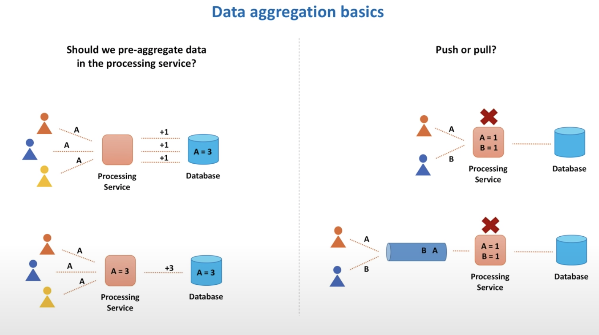
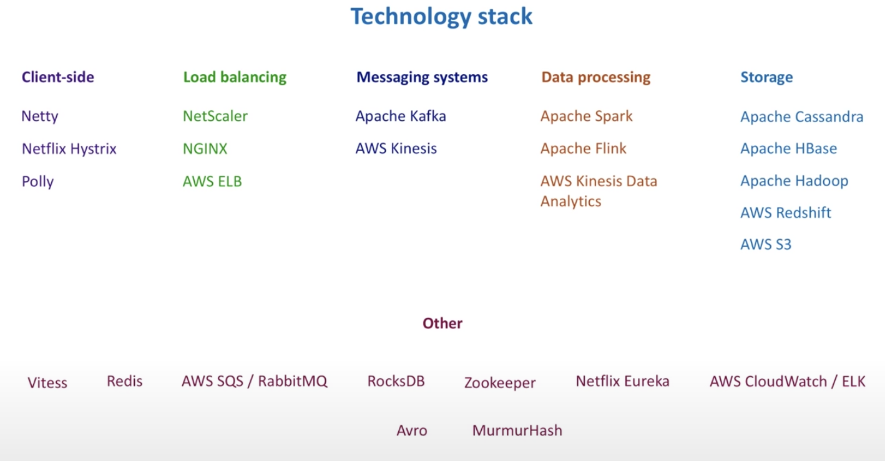

# System design prep
* https://www.youtube.com/watch?v=bUHFg8CZFws&ab_channel=SystemDesignInterview

## Summary

### Problem statement
- Count large number of things: YouTube video views, likes on Facebook.
- Then to more generic ones: calculate app performance metrics (multiple large number of things), analyze data in real-time, etc.

### Stage 1: Requirements clarification 

Requirements clarification is important. How to deal with **ambiguity**?

e.x. to count YouTube viewers, SQL / NoSQL / Batch processing / Stream processing / Cloud native stream processing / Cache / ...
 Many many solutions, with proc and cons for each. 

#### Requirements clarification 4 main focuses:
1. Users/Customers
    - Who will use the system?
      - YouTuber, Engineers
    - How the system will be used?
      - Real-time recommendation
      - Marketing team analyze purpose (not retrieved often)
2. Scale (read/write)
    - How many read queries/sec?
    - How much data queried/req?
    - How many video views are processed/sec?
    - Spikes in traffic?
3. Performance
    - Expected write-to-read data delay?
    - Expected p99 latency for read queries?
4. Cost
    - Cost of development minimize?
      - Can we use more opensource frameworks, etc.
    - Cost of maintenance minimize?

#### Functional vs Non-functional requirements
- Functional: system behavior, what the system does, APIs to define
- Non-functional: system quality, how the system does, fast, fault-tolerant, security, etc.

**Functional requirements - API**
1. Write your requirements in sentences.
2. Break it into functions and maybe generalize them.

> The system has to [count] [video] [view] [events].
> - countViewEvent(videoId) -> start with taking 1 input
> - countEvent(videoId, eventType) -> generalize 1 more element: view/like/share
> - processEvent(videoId, eventType, function) -> generalize 1 more elemenet: count/sum/average
> - processEvents(listOfEvent) -> generalize more to a list of events, each event contains all info needed

> The system has to return [video] [views] [count] for a [time period].
> - getViewsCount(videoId, startTime, endTime)
> - getCount(videoId, eventType, startTime, endTime) -> view/like/share
> - getStats(videoId, eventType, function, startTime, endTime) -> count/sum/avg

**Non-functional requirements**

Usually clear non-functional requirements not provided. We would get vague statements like “we want big scale and make it as fast as possible”, so it's up to us to decide on the tradeoffs.

- Write the requirements on whiteboard to keep reminding ourselves
- Focus on 3 top priorities:
  - **Scalable** (10,000+ video views per second)
  - Highly **Performant** (~10 milliseconds to return total views of a video)
  - Highly **Available** (survives hardware/network failures, no single point of failure)
- Plus two more:
  - **Consistency**
    - CAP theorem: between availability and consistency, choose availability
    - Eventual consistency: Sometimes some replicas can be behind some other replicas, but eventually updates will propagate to the entire system
  - **Cost**
    - hardware, development, maintenance

### Stage 2: High-level architecture

Start with something simple:

1. Database: to store data
2. Web service: to process incoming video view events and store data in DB
3. Another web service: to retrieve view counts from DB

### Stage 3: Detailed design

Then start assembling a puzzle, from outside pieces first: DATA

#### DATA
1. What data we want to store: **define a data model**
    - 2 options: 
      1. store individual events (each click/view), 
          - Keep all info/details
          - Fast writes
          - Can slice and dice data as we want
          - Recalculate if needed
          - Slow reads (count, etc.)
          - Costly for a large scale
      2. aggregate data in real-time (calculate aggregated views, per min data for example, on the fly and store)
          - Lose some info/details
          - Fast reads
          - Data is ready for decision making in real-time
          - Can only query as it’s aggregated
          - Requires data aggregation pipeline (data in memory before db)
          - Hard/impossible to fix errors (fixed a bug, how to fix earlier aggregated data?)
    - Which to choose? Ask the interviewer about expected data delay.
        - Time between [event happened -> it’s processed]
          - < Several minutes: aggregate on the fly -> **stream data processing**
          - Several hours: record individual raw events and aggregate later -> **batch data processing**
        - Combine both approaches (makes sense to a lot of systems)
          - Store raw events for several days/weeks only and then purge
          - Also calculate and store numbers in real-time so stats is ready right away
          - Flexible, pros for both approaches
          - Price to pay as well, more complex and expensive
 
2. **Where** to store data?
    - Both **SQL** and **NoSQL** DB can scale and perform well
    - Evaluate both against non-functional requirements
    - Make a list to evaluate:
        1. *Scalability*: How to scale writes?
        2. *Scalability*: How to scale reads?
        3. *Performance*: How to make both write/read fast?
        4. *Availability*: How not to lost data on hardware faults and network partitions?
        5. *Consistency*: How to achieve strong consistency? Tradeoffs? 
        6. How to recover data in case of an outage?
        7. How to ensure data security?
        8. How to make it extensible for data model changes in the future?
        9. Where to run (cloud vs on-premises data centers)?
        10. *Cost*: How much will it all cost?
       
    - SQL Database (MySQL)
      
        - It is similar to what Youtube does: **Vitess**
        - When data exceeds 1 database, we need to shard/partition data.
        - Processing service (write) and Query service (read) talk to a cluster proxy instead of shards directly.
        - Configuration service: 
          - On the cluster proxy, it knows about all the machines, and routes traffic to the correct shard. (e.x. ZooKeeper). 
          - It also knows when some shard dies or becomes unavailable due to network partition, and new shard added to the database cluster. 
          - Maintains health checks to all machines, and always knows what machines are available.
        - Shard Proxy:
          - Sits in front of a database.
          - Cache query results, monitor db instance health and publish metrics, terminate queries that takes too long to return, etc.
        - Replication:
          - Master shards and read replicas (follower shards).
          - Writes still go through master shards, but reads may go through both masters and replicas.
          - Can also put replicas in different data centers than the masters so if the whole data center goes down, a copy is still available.
    
    - NoSQL Database (Apache Cassandra database)
      
        - All shards are equal (nodes), no leader.
        - Shards talk to each other and exchange info about state.
        - Usually per second shard may exchange info with only a few other shards (<= 3) to reduce network load.
        - Quickly enough, state info about every node propagates throughout the cluster -> **gossip protocol**
        - Clients (processing/query services) no longer need to call a special component for routing requests. They may call any node in the cluster, and the node will forward the request. 
        - Node selection for client: round robin, closest network-wise, etc.
        - The selected node (coordinator node) needs to decide which node stores data for the requested. (Consistent hashing algorithm).
        - Coordinator node makes a request to the node of requested data and wait for response. 
        - Coordinator node can also call multiple nodes to replicate data, and can do quorum writes and quorum reads. 
          - Wait for > half of machines to respond
        - Version number to determine staleness of data.
          - Replicas might not be up-to-date yet
        - Data can also be stored across different data centers.
        - Cassandra extends eventual consistency to tunable consistency. (Not discussed in this video)

3. **How** to store the data?

    - SQL: Relational databases, usually start with defining **nouns** in the system, then convert into tables and use foreign keys to reference related data. Example:
      - Build a report: information about video, number of total views per hour for last several hours, info about channel of the video
      - Input: video identifier
      - Relational database has 3 tables: video_info, video_stats, channel_info
      - Query: JOIN query of 3 tables to get all info we need
      - Important property of relational database: data is normalized.
        - Minimize data duplication across tables
    - Cassandra: non-relational databases, start with **query logics** in the system, not nouns. We store everything required for a query together.
      - Keep adding columns for every next hour stats
      - 4 types of NoSQL databases: column, document, key-value and graph
        1. Cassandra: wide column database with asynchronous masterless replication
        2. MongoDB: document-oriented database with leader-based replication
        3. HBase: column-oriented data store with master-based architecture

#### Processing service
- In this video views example, processing means: get a video view event -> increment several counters: total + per hour
- Start with requirements: scalable + reliable + fast
    1. How to **scale**? (with video views increase)
    2. How to achieve **high throughput**? (process events quickly)
    3. How **not to lose data** when processing node crashes? 
    4. What to do when database **unavailable** or slow?
- General first intuition about the requirements, then try to see how we can combine all:
    1. Scalable -> **partitioning**
    2. Reliable -> **replication and checkpointing**
    3. Fast -> **in-memory data**
- Some data aggregation basics:
  
    1. **Pre-aggregate** data (in memory) in the processing service is better (than updating databases for each write).
    2. **Push** or **pull**? 
        - Push: other service sending events synchronously to the processing service
        - Pull: processing service pulling events from some temporary storage
        - **Pull** is better for fault-tolerance because it allows to re-process on crash
    3. Checkpointing
        - Mark in temporary storage (event queue) when writing to database (permanent storage)
        - After crash it can start reprocessing from the checkpoint
    4. Partitioning
        - Several different exclusive queues to store events, each living on its own machine.
        - Select each queue with some algorithm, e.x. hash function. 
        - This allows us to process in parallel.
- Design details
  
  
    - Partition consumer
      - Keep pulling from the temporary storage (TCP connection)
      - Eliminate duplicate events
        - Can use a distributed cache (stores unique event id in last, say, 10 min)
      - Deserialize the event (byte array -> actual object)
      - Can consume in parallel
        - Faster
        - Checkpointing becomes more complicated and it is harder to preserve order
    - Aggregator
      - Does the in-memory counting and write to the in-memory storage (e.x. a hash table)
      - Periodically create and start writing to a new table and send the old table to an internal queue for further processing and/or writing to database
    - Internal queue
      - Allows us to further process the data in parallel
    - Dead-letter queue
      - If database is unavailable, put the message in the dead letter queue and handle it again later (send again, put into machine disk, etc.)
    - Embedded database
      - Sometimes we need info other than what we have in the event
        - The event might only have video id, but we also need video name and channel name
        - They are in some other tables but we want to get the information quickly
      - Store some info in a database on the processing machine to retrieve these info really fast
      - LinkedIn uses this concept for “who viewed your profile”
    - State store
      - Store the whole memory state to some durable storage periodically for easier recovery

#### Partitioner Service Client 
- Client makes a request to a server, server processes the request and sends back a response - **API Gateway**
- Blocking I/O
    - A new thread started to handle the socket received, waits for process to end and sends response back. 
    - One thread per connection.
    - When machines slow down or something happens, they can go into a death spiral and the whole cluster may die.
    - Rate limiter to keep the system stable.
- Non-blocking I/O
    - Server queues the request and the actual I/O is processed at some later point.
    - Less expensive than piling up threads.
    - More efficient and higher throughput.
    - Increased complexity of operations, harder to debug.
- Buffering and batching
    - Too many events happening at the same time, if each event starts a request, will overload API Gateway cluster and it’s not efficient.
    - Buffer: put multiple events into a buffer
    - Batching: wait up to several seconds or until batch fills up and then send the whole buffer’s content as a single request
    - Increase throughput, save cost, more effective.
    - More complexity both on client and server side.
      - e.x. Partial of the batch failed, re-send whole batch or failed ones?
- Timeouts
    1. Connection timeout
      - Client’s wait on **connection** to establish, usually small (10s milliseconds)
    2. Request timeout
      - Client’s wait on **processing** of the request, choose value based on percentile, e.x. 99% fastest time
- Retries: on failed/timeout requests
    - Retry storm: If all clients retry at the same time, they will overload servers.
    - Exponential backoff and jitter algorithms
        - Exponential backoff: increase the waiting time between retires to a max backoff time, wait a bit longer for each retry.
        - Jitter: adds randomness to retry intervals to spread out the load.
- Circuit breaker: stops a client from repeatedly trying to execute an operation that's likely to fail. 
    1. Calculate how many requests failed recently and if exceeds threshold stop calling downstream service. 
    2. Some time later, limited number of requests allowed to pass through.
    3. If successful, assume failure has been fixed. Allow all requests and start counting failed ones from 0.
    - More difficult to test, hard to properly set error threshold and timers.

#### Load Balancer
- Distribute data traffic between multiple servers.
- Hardware load balancer
    - Powerful network devices, many CPU, memory and can handle millions of requests per second.
- Software load balancer
    - Many are open source
    - Public clouds provide as well (e.x. ELB from AWS)
- Networking protocols
    - TCP load balancers
      - Simply forward packets without inspecting, super fast and handle millions of requests per second.
    - HTTP load balancers
      - Can terminate the connection, look inside a message and make a decision based on content of the message like cookie or header.
- Load balancing algorithms
    - Round robin
    - Least connections
    - Least response time
    - Hash-based algorithms (on key we define, IP, URL, etc.)
- DNS: Domain Name System
    - Register partitioner service in DNS
    - Associate it with IP of load balancer device
    - Client requests are forwarded to load balancer device
    - Each server machine’s IP is registered on load balancer
      - Both hardware/software load balancers have APIs for server registration
- Health checking
    - Load balancers do health checks for the servers on registered list, and stops/resumes requests accordingly.
- High availability
    - Load balancers are replicated and placed in different data centers. (Primary + Backup)

#### Partitioner Service and Partitions
- Partitioner Service
    - Gets requests and route individual event to some partition
- Partition
    - Gets messages and stores them on disk in append-only log file (so totally-ordered sequence)
    - Not a single file, but a set of log files of predefined size
- Partition strategy
    - Hash function based on some key
    - **Hot partitions**: some keys maybe very popular
    - Solutions
      - Include time in key as well
      - Split hot partitions
      - Dedicated partitions for some popular keys
- Service discovery: Partitioner service needs to know about every partition
    - Server-side discovery: similar to load balancer
    - Client-side discovery: every server instance registers itself in some **common place** (service registry), e.x. ZooKeeper.
- Replication:
    - Single leader: like SQL example above
    - Multi leader: mostly used to replicate between several data centers
    - Leaderless: like Cassandra example above
    - For partition, we use single leader with quorum voting
- Message format:
    - Textual format: XML, CSV, JSON
        - Readable but repetitive info
    - Binary format: Thrift, Protocol Buffers, Avro
        - Faster to parse and more compact, but less readable

- API Gateway
    - A single-entry point to route client requests to backend services
- Data rollup
    - Per minute data saved for several days
    - Aggregate into per hour data and save for several months
    - Aggregate into per day data for older than 3 months
- Hot storage and cold storage
    - **Hot**: frequently used data that must be accessed fast
    - **Cold**: doesn’t require fast access
      - So we can put old data in AWS S3 for cold storage
- Data federation
    - Query service may need to call several storages and then stitches the data
- Distributed cache
    - Store queries results and further improve performance

#### Technology stack

1. **Netty**: High-performance non-blocking I/O framework for both client and servers
2. **Netflix Hystrix / Polly**: for many client-side concepts like timeouts, retries, circuit breaker, etc.
3. **NetScaler**: most famous hardware load balancer
4. **NGINX**: software load balancer
5. **AWS ELB**: AWS Elastic Load Balancer
6. **Apache Kafka**: partioner service and partitions
7. **Amazon Kinesis**: public cloud partitioner service and partitions
8. **Apache Spark/Flink**: stream-processing frameworks
9. **Kinesis Data Analytics**: cloud-based stream-processing solution
10. **Apache HBase**: popular choice for storing time-series data (wide column db similar to Cassandra)
11. **Apache Hadoop / AWS Redshift**: store raw events for recalculation, error or ad-hoc queries
12. **AWS S3**: for archive rolled up data
13. **Vitess**: scaling and managing large clusters of MySQL instances (Youtube since 2011)
14. **Redis**: distributed cache for message duplications and scale read queries 
15. **RabbitMQ / Amazon SQS**: message-broker, for dead-letter queue mechanism
16. **RocksDB**: high performance embedded database for key-value data
17. **Apache Zookeeper**: distributed configuration service, for leader election for partitions and manage service discovery
18. **Netflix Eureka**: alternative service discovery solution
19. **AWS CloudWatch / ElasticSearch, Logstash, Kibana**: monitor system design components
20. **MurmurHash**: a good hashing function

### Stage 4: Bottlenecks and tradeoffs

- To identify bottlenecks: performance testing
    - Load testing: a specific expected load
      - Check system is indeed scalable and can handle the expected load
    - Stress testing: beyond normal operational capacity, often to a breaking point
      - Want to identify the breaking point in the system
      - Which component starts to suffer first: memory, CPU, network, disk I/O, etc.
    - Soak testing: with a typical production load for an extended period of time
      - Find leaks in resources, e.x. memory leaks
    - **Apache JMeter**: generate a desired load
- Health monitoring
    - Metrics, dashboards and alerts
    - Four golden signals of monitoring: latency, traffic, errors and saturation
- Correctness test: did we count the numbers correctly?
    - Weak audit system
      - Continuously running end-to-end test
      - Say once a minute, generate several video view events in the system and validate the returned value
      - Not 100% reliable, cannot catch rare scenarios
    - Strong audit system
      - Store raw events in Hadoop and use MapReduce to count events
      - Compare results of both systems (our main and MapReduce)
      - **Lambda Architecture**
        - Send events to a batch system and a stream processing system in parallel, and stitch the results together at query time
        - (Not ideal) we want to have a single system
- Hot partition solution
    - Batch events and store in S3
    - At every persist, send a message to a message broker like SQS
    - A big cluster of machines like EC2 retrieve messages from SQS, read a batch from S3 and process
    - This architecture is a bit slower than stream process but faster than batch process (like stream of batches)

