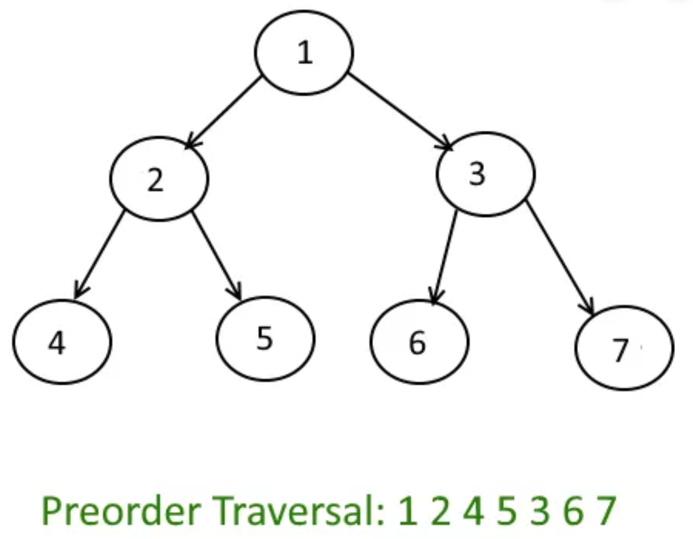
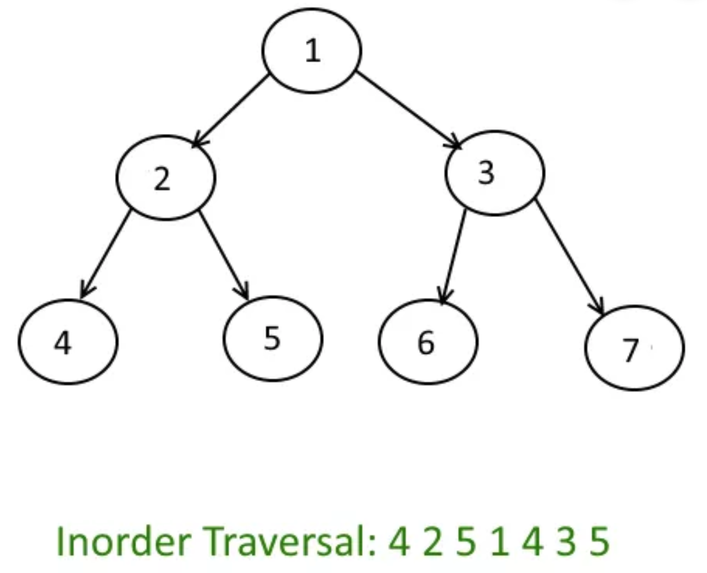
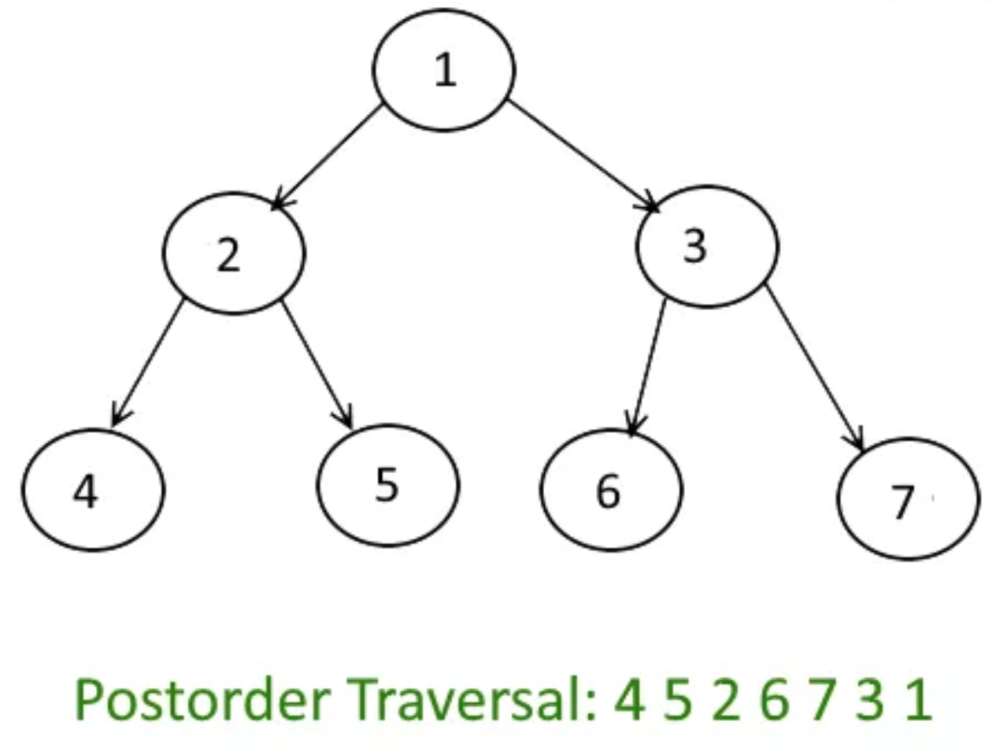

# Tree Core Algorithms

In trees, there are two main points of view: recursive and iterative.

Core algorithms include **(1) BST methods, (2) PreOrderRecursive, (3) PreOrderIterative, (4) InOrderRecursive, (5) InOrderIterative, (6) PostOrder recursive, (7) PostOrderIterative, (8) BFS, (9) DFS, (10) LevelOrder**. Once you completely understand these, you can solve any tree question. 

### BST Methods

```javascript
public class BST {
    /*****************************************************
    *
    *            INSERT
    *
    ******************************************************/
       public void insert(T data)
       {
          root = insert(root, data);
       }
       private Node<T> insert(Node<T> p, T toInsert)
       {
          if (p == null)
             return new Node<T>(toInsert);
    
          if (compare(toInsert, p.data) == 0)
            return p;
    
          if (compare(toInsert, p.data) < 0)
             p.left = insert(p.left, toInsert);
          else
             p.right = insert(p.right, toInsert);
    
          return p;
       }
    
    /*****************************************************
    *
    *            SEARCH
    *
    ******************************************************/
       public boolean search(T toSearch)
       {
          return search(root, toSearch);
       }
       private boolean search(Node<T> p, T toSearch)
       {
          if (p == null)
             return false;
          else
          if (compare(toSearch, p.data) == 0)
            return true;
          else
          if (compare(toSearch, p.data) < 0)
             return search(p.left, toSearch);
          else
             return search(p.right, toSearch);
       }
    
    /*****************************************************
    *
    *            DELETE
    *
    ******************************************************/
    
       public void delete(T toDelete)
       {
          root = delete(root, toDelete);
       }
       private Node<T> delete(Node<T> p, T toDelete)
       {
          if (p == null)  throw new RuntimeException("cannot delete.");
          else
          if (compare(toDelete, p.data) < 0)
          p.left = delete (p.left, toDelete);
          else
          if (compare(toDelete, p.data)  > 0)
          p.right = delete (p.right, toDelete);
          else
          {
             if (p.left == null) return p.right;
             else
             if (p.right == null) return p.left;
             else
             {
             // get data from the rightmost node in the left subtree
                p.data = retrieveData(p.left);
             // delete the rightmost node in the left subtree
                p.left =  delete(p.left, p.data) ;
             }
          }
          return p;
       }
       
       /*************************************************
        *
        *            CLONE
        *
        **************************************************/
       
          public BST<T> clone()
          {
             BST<T> twin = null;
       
             if(comparator == null)
                twin = new BST<T>();
             else
                twin = new BST<T>(comparator);
       
             twin.root = cloneHelper(root);
             return twin;
          }
          private Node<T> cloneHelper(Node<T> p)
          {
             if(p == null)
                return null;
             else
                return new Node<T>(p.data, cloneHelper(p.left), cloneHelper(p.right));
          }

}
```

## Preorder 



### Preorder Recursive
```javascript
public static void preorder(Node root) {
    if (root == null) {
        return;
    }
    System.out.println(root.data);
    preorder(root.left);
    preorder(root.right);
}
```

### Preorder Iterative
```javascript
List<Integer> preorderIterative(TreeNode root) {

    List<Integer> list = new ArrayList<>();
    if (root == null) {
        return list;
    }
    Stack<TreeNode> stack = new Stack<>();
    stack.push(root);

    while (!stack.isEmpty()) {
        TreeNode popped = stack.pop();
        list.add(popped.val);

        // you want left to be printed first, so let's push right before left.
        if (popped.right != null) {
            stack.push(popped.right);
        }
        if (popped.left != null) {
            stack.push(popped.left);
        }
    }

    return list;
}
```

## Inorder 
Inorder Traversal: 4 2 5 1 6 3 7 (The image has the order wrong)


### Inorder Recursive
```javascript
public static void inorderRecur(Node root) {
    if (root == null) {
        return;
    }
    inorderRecur(root.left);
    System.out.println(root.data);
    inorderRecur(root.right);
}
```
### Inorder Iterative

```javascript
public List<Integer> inorderTraversalIterative(TreeNode root) {
    List<Integer> result = new ArrayList<>();
    TreeNode cur = root;
    Stack<TreeNode> stack = new Stack<>();

    // TODO should it be AND or OR? - the explanation is written on step 4-b
    while (cur != null || !stack.isEmpty()) {
        while (cur != null) {
            stack.push(cur);
            cur = cur.left;
        }

        // cur is null at this point.
        TreeNode popped = stack.pop();

        result.add(popped.val);

        if (popped.right != null) {
            cur = popped.right;
        }

    }

    return result;} 
```

## Postorder 


Note that if you do postorder backwards, it's preorder.

### Postorder Recursive
```javascript
private void postOrder(Node root) {
    if (root == null) {
        return;
    }
    Utils.print(root.data);
    postOrder(root.left);
    postOrder(root.right);
}

```
### Postorder Iterative

```javascript
public List<Integer> postorderTraversal(TreeNode root) {
    List<Integer> list = new ArrayList<>();
    if (root == null) {
        return list;
    }
    Stack<TreeNode> pre = new Stack<>();
    Stack<TreeNode> post = new Stack<>();

    pre.push(root);

    while (!pre.isEmpty()) {
        TreeNode popped = pre.pop();
        post.push(popped);

        if (popped.left != null) {
            pre.push(popped.left);
        }

        if (popped.right != null) {
            pre.push(popped.right);
        }
    }

    while (!post.isEmpty()) {
        TreeNode popped = post.pop();
        list.add(popped.val);
    }

    return list;
}
```

## BFS
Just replace PreOrder's Stack with a queue!

```javascript
public static List<Integer> bfs(TreeNode root) {
    List<Integer> result = new ArrayList<>();

    if (root == null) {
        return result;
    }

    Queue<TreeNode> queue = new LinkedList<>();
    while (!queue.isEmpty()) {
        TreeNode popped = queue.poll();
        result.add(popped.val);
        if (root.left != null) {
            queue.add(root.left);
        }

        if (root.right != null) {
            queue.add(root.right);
        }
    }

    return result;
```

## DFS
Its algorithm is same as that of preorder

## Level Order

### Question: Can you solve this problem and fill in the level order section: 

[levelorder](https://leetcode.com/problems/binary-tree-level-order-traversal/)

### Question2: What is the difference between BFS and Level order?

