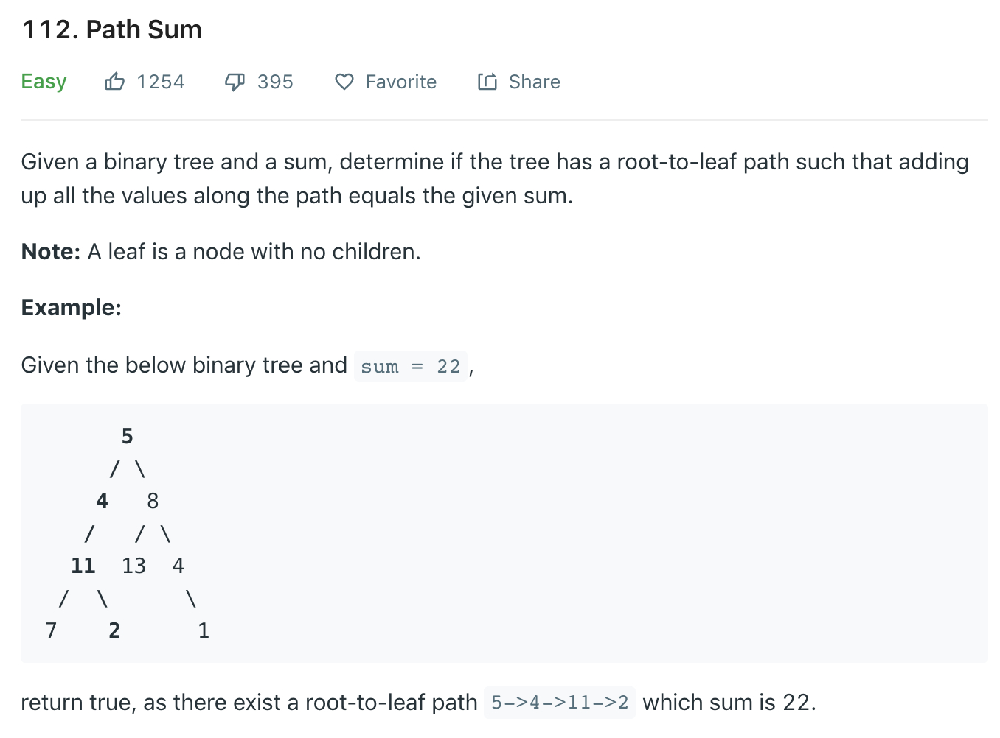
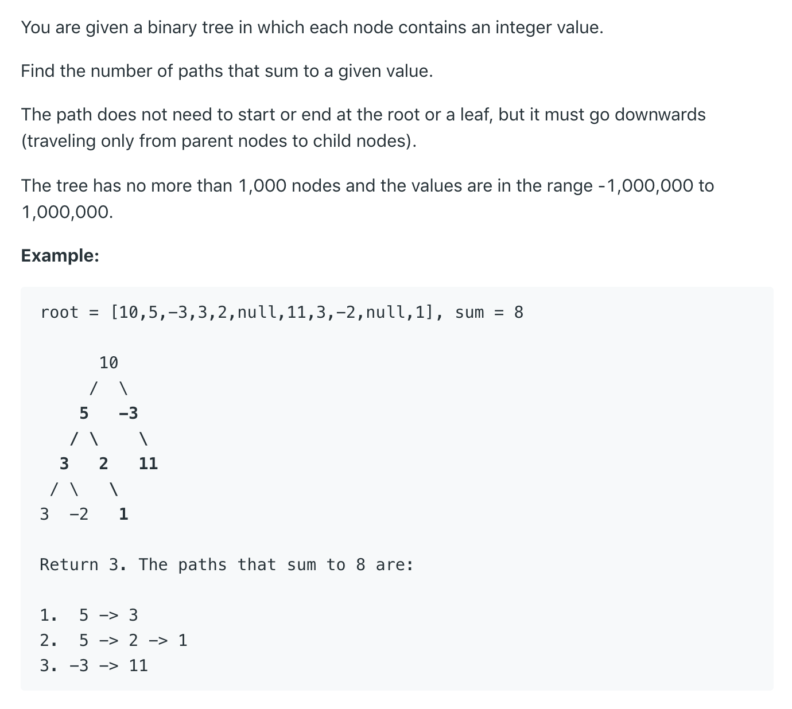
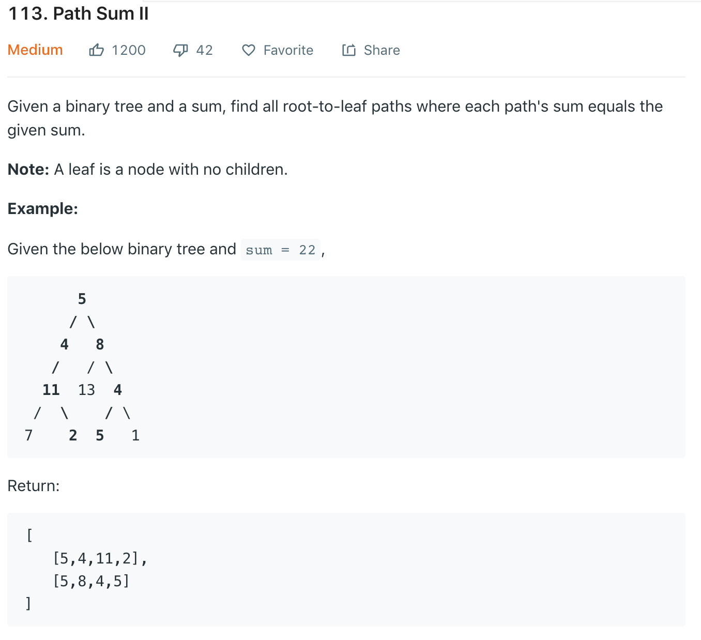
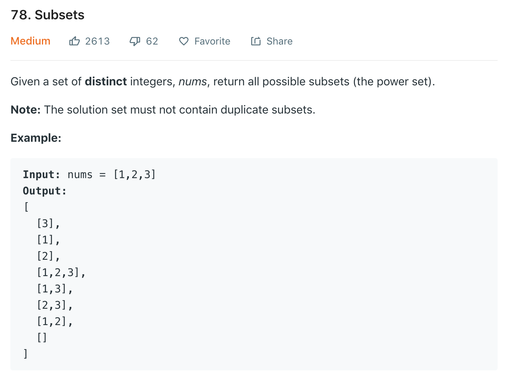
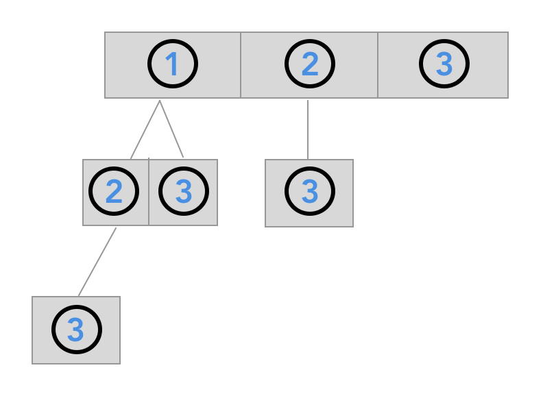

# Path Sum Type Problems
## Path Sum I
The following problem is from [Leetcode](https://leetcode.com/problems/path-sum/)




 
 ```java
 // finished code
 
 private boolean pathExists;
 public void preorder(TreeNode node, int inherited) {
     if (node == null) {
         return;
     }
     
     if (node.left != null && node.right != null) {
        if (inherited == node.val) {
            pathExists = true;
         }
     }
     
     preorder(node.left, inherited - node.val);
     preorder(node.right, inherited - node.val);
 }
 ```
 
  ```java
  // finished code
  
  private boolean pathExists;
  public void inorder(TreeNode node, int inherited) {
      if (node == null) {
          return;
      }
      
      inorder(node.left, inherited - node.val);
      
     if (node.left != null && node.right != null) {
        if (inherited == node.val) {
            return pathExists = true;
         }
     }
      
      inorder(node.right, inherited - node.val);
  }
  ```
  
  ```java
      private boolean pathExists;
      public void inorder(TreeNode node, int inherited) {
          if (node == null) {
              return;
          }
          
          inorder(node.right, inherited - node.val);
          inorder(node.left, inherited - node.val);
    
          if (node.left == null && node.right == null) {
              if (inherited == node.val) {
                  pathExists = true;
              }
          }
          
          inorder(node.left, inherited - node.val);
          inorder(node.right, inherited - node.val);
      }
   ```
## Path Sum III
The following problem is from [Leetcode](https://leetcode.com/problems/path-sum-iii/)



```java
private int wrongUtil(TreeNode root, int sum) {
    if (root == null) {
        return 0;
    }

    /**
     Short-circuiting the finding. If there are multiple ending points it won't find all of them, but 
     the traversal will be over at the first finding. 
     */
    if (root.val == sum) {
        return 1;
    }

    return wrongUtil(root.left, sum - root.val) + wrongUtil(root.right, sum - root.val);
}
```

This does not short-circuit in finding one ending node and continue the search.

```java
private int util(TreeNode root, int sum) {
    if (root == null) {
        return 0;
    }

    int leftValue = util(root.left, sum - root.val);
    int rightValue = util(root.right, sum - root.val);
    int currentNodeValue = root.val == sum ? 1 : 0;
    return leftValue + rightValue + currentNodeValue;
}
```

 ```java
 private int counter;
 private void util(TreeNode root, int sum) {
     if (root == null) {
         return;
     }
 
     if (root.val == sum) {
        counter++;
     }
     util(root.left, sum - root.val);
     util(root.right, sum - root.val);
 }
 ```
 
  ```java
  private int counter;
  private void util(TreeNode root, int sum) {
      if (root == null) {
          return;
      }
  
      util(root.left, sum - root.val);
      if (root.val == sum) {
         counter++;
      }
      util(root.right, sum - root.val);
  }
  ```
 

```java
public int pathSum(TreeNode root, int targetSum) {
    if (root == null) return 0;
    
    
    int left = pathSum(root.right, targetSum);
    int right = pathSum(root.left, targetSum);
    int current = util(root, targetSum);
    return left + right + current;
}
```


```java
public int pathSum(TreeNode root, int targetSum) {
    if (root == null) return 0;
    pathSum(root.right, targetSum);
    util(root, targetSum);
    pathSum(root.left, targetSum);
    return counter;
}
```

```java
private int counter;
public int pathSum(TreeNode root, int targetSum) {
    if (root == null) return 0;
    pathSum(root.right, targetSum);
    counter += util(root, targetSum);
    pathSum(root.left, targetSum);
    return counter;
}
```

* The time complexity of all these functions is O(N^2) worst case and O(NLogN) best case.
* The space complexity is (N) in worst case and (logN) in best case (Question for Yanqing: I am not sure. What do you think?) 





```java
public List<List<Integer>> pathSum(TreeNode root, int targetSum) {
    List<List<Integer>> answer = new ArrayList<>();
    List<Integer> intermediateResult = new ArrayList<>();
    preorder(root, targetSum, intermediateResult, answer);
    return answer;
}

private void preorder(TreeNode root, int targetSum, List<Integer> intermediateResult, List<List<Integer>> answer) {
    if (root == null) {
        return;
    }
    intermediateResult.add(root.val);
    
    if (root.left == null && root.right == null) {
        if (root.val == targetSum) {
            answer.add(new ArrayList<>(intermediateResult));
        }
    }
        
    preorder(root.left, targetSum - root.val, intermediateResult, answer);
    preorder(root.right, targetSum - root.val, intermediateResult, answer);
    
       /**
         leaf nodes and non leaf nodes, both of them can reach this line, because there's no short-circuiting in the leaf nodes. it's very important to visualize this part. if you are a leaf node, both of your left and right null nodes are visited and they are not added to the intermediate result and the decision of whether to add to the result or not is made up there, and now you just need to remove yourself because the recursive calls are at the end. There's no more results to verify. If you are a non-leaf node, your left and right children are just traversed and you need to remove yourself before the function is over, so your parent can now traverse the next child of candidate. Note that removal is done in the post order level, which means all the work is already done and you want to prepare for the next work and the only preparation you need to do is removing yourself, so the next nodes can be added.
         */
    intermediateResult.remove(intermediateResult.size() - 1);
}
```

would the following code work?

```java
public List<List<Integer>> pathSum(TreeNode root, int targetSum) {
    List<List<Integer>> answer = new ArrayList<>();
    List<Integer> intermediateResult = new ArrayList<>();
    preorder(root, targetSum, intermediateResult, answer);
    return answer;
}

private void preorder(TreeNode root, int targetSum, List<Integer> intermediateResult, List<List<Integer>> answer) {
    if (root == null) {
        return;
    }
    intermediateResult.add(root.val);
    
    if (root.left == null && root.right == null) {
        if (root.val == targetSum) {
            answer.add(new ArrayList<>(intermediateResult));
        }
        return; // this is newly added
    }
        
    preorder(root.left, targetSum - root.val, intermediateResult, answer);
    preorder(root.right, targetSum - root.val, intermediateResult, answer);
    
    intermediateResult.remove(intermediateResult.size() - 1);
}
```

No, it would not work, because the leaf nodes cannot go all the way down to the preorder recursive calls to call its null left and null right adn then remove itsself from the list in the last line of code. 


Then if I keep the return statement in the leaf node if statement and add removing the leaf node part, would the following code work?

```java
public List<List<Integer>> pathSum(TreeNode root, int targetSum) {
    List<List<Integer>> answer = new ArrayList<>();
    List<Integer> intermediateResult = new ArrayList<>();
    preorder(root, targetSum, intermediateResult, answer);
    return answer;
}

private void preorder(TreeNode root, int targetSum, List<Integer> intermediateResult, List<List<Integer>> answer) {
    if (root == null) {
        return;
    }
    intermediateResult.add(root.val);
    
    if (root.left == null && root.right == null) {
        if (root.val == targetSum) {
            answer.add(new ArrayList<>(intermediateResult));
        }
        intermediateResult.remove(intermediateResult.size() - 1); // newly added code
        return;
    }
        
    preorder(root.left, targetSum - root.val, intermediateResult, answer);
    preorder(root.right, targetSum - root.val, intermediateResult, answer);
    
    intermediateResult.remove(intermediateResult.size() - 1);
}
```

Yes, it does. Why? Because now the leaf nodes get to remove themselves and the parent nodes, after visiting its left and right children, get to remove themselves from the list. So every node of the tree gets to remove themselves. If a node has two leaf children, the children will be removed in the if block. If a node has one null and one child, the null part was never added to the list and non null child was removed. So after its children are removed, the node just has to remove itself. 

Important to note that if you don't have the return statement and only remove in the leaf node if statement, it will not work either. The reason is now the leaf nodes will visit its left null and right null with the recursive calls in the next lines of code and will try to remove itself again in the last line of code.

Another way to remove nodes and continue the list is the following. 

```java
private void preorder(TreeNode root, int targetSum, List<Integer> intermediateResult, List<List<Integer>> ans) {

    intermediateResult.add(root.val);
    
    if (root.left == null && root.right == null) {
        if (root.val == targetSum) {
            ans.add(new ArrayList<>(intermediateResult));
        }
        intermediateResult.remove(intermediateResult.size() - 1);
        return;
    }
        
    if (root.left != null) {
        preorder(root.left, targetSum - root.val, intermediateResult, ans);
    }
    if (root.right != null) {
        preorder(root.right, targetSum - root.val, intermediateResult, ans);
    }
    intermediateResult.remove(intermediateResult.size() - 1);
}
```

Now consider the last but not least variation.

```java
private void preorder(TreeNode root, int targetSum, List<Integer> intermediateResult, List<List<Integer>> ans) {

    intermediateResult.add(root.val);
    
    if (root.left == null && root.right == null) {
        if (root.val == targetSum) {
            ans.add(new ArrayList<>(intermediateResult));
        }
        return;
    }
        
    if (root.left != null) {
        preorder(root.left, targetSum - root.val, intermediateResult, ans);
        intermediateResult.remove(intermediateResult.size() - 1);
    }
    if (root.right != null) {
        preorder(root.right, targetSum - root.val, intermediateResult, ans);
        intermediateResult.remove(intermediateResult.size() - 1);
    }
}
```

Every child is removing itself and letting the parent node to start a new path. Every node is visiting the left child node only if it exists and remove that element only if it was added in the first place; same goes for the right child node. 

# Backtracking
## Subsets

Now you will see why recursive way of thinking is important. It's because you can turn turn some problems into trees and recursion provides an exhausting solution. 



You can turn this problem into the form of trees by think of it as n-ary tree nodes. 



Every node is generating a subset. In the first node 1 is generating [1] and its child 2 is generating [1,2]. Then 2's child 3 generates [1,2,3]. You can solve this problem like pathsum 2 except that you are adding every list from the root to a child node to the final result. 

* Time complexity: [Question for Yanqing]
* Space complexity: [Question for Yanqing]
```java
public List<List<Integer>> subsets(int[] nums) {
    List<Integer> intermediateResult = new ArrayList<>();
    List<List<Integer>> answer = new ArrayList<>();
    preorder(nums, 0, intermediateResult, answer);
    return answer;
}

private void preorder(int[] nums, int start, List<Integer> intermediateResult, List<List<Integer>> answer ) {

    answer.add(new ArrayList<>(intermediateResult));
    
    for (int i = start; i < nums.length; i++) { // 1
        int cur = nums[i];
        intermediateResult.add(cur);
        preorder(nums, i + 1, intermediateResult, answer);
        // after going through one child, each node is removing itself before moving onto its sibling. 
        intermediateResult.remove(intermediateResult.size() - 1);
    }
}
```
It's important to understand when intermediate result list is added to the answer list and when the node is removed from the list. the answer starts beginning the function by adding the empty intermdiate result. For every node it adds to the intermediate result and the intermdiate result is added to the answer list in its child node level. And the node is removed from the intermeidate list after every level of chis is explored and before moving onto its sibling. 

# Practice problems
* https://leetcode.com/problems/diameter-of-binary-tree/
* https://leetcode.com/problems/binary-tree-maximum-path-sum/